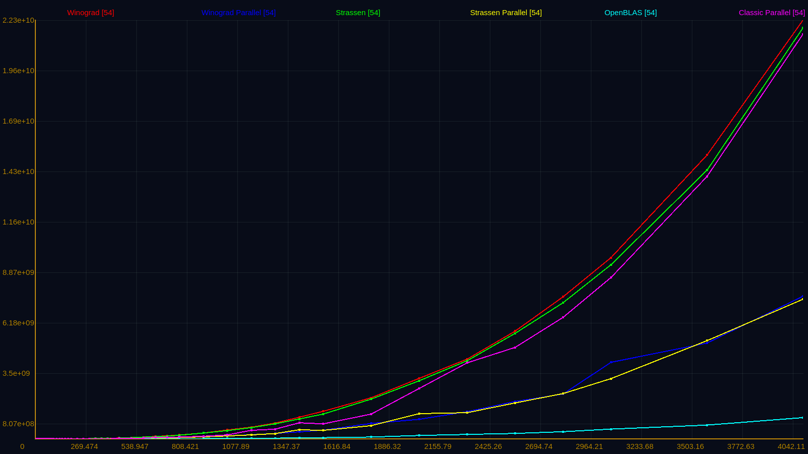

### Matrix Multiplication Algorithms

    This repository contains the implementation of different matrix multiplication algorithms and their performance analysis.

    Matrix multiplication is a fundamental operation in linear algebra that involves multiplying two matrices to produce a third matrix. The problem of matrix multiplication is to find an efficient algorithm to compute the product of two matrices. The straightforward algorithm has a time complexity of O(n^3), which is not efficient for large matrices. Therefore, researchers have developed various algorithms to improve the efficiency of matrix multiplication.

1. [Description of Algorithms](#description-of-algorithms)
2. [Parallel Processing](#parallel-processing)
3. [Performance Comparison](#performance-comparison)
4. [Recursive Algorithm Analysis](#recursive-algorithm-analysis)
5. [Big O Notation Calculation](#big-o-notation-calculation)
6. [Profiling and Optimization](#profiling-and-optimization)
7. [Memory Usage Analysis](#memory-usage-analysis)
8. [Impact of Compiler Optimization](#impact-of-compiler-optimization)
9. [Algorithmic Accuracy and Precision](#algorithmic-accuracy-and-precision)

## Description of Algorithms
# Strassen's and Winograd's Algorithms
Strassen's and Winograd's algorithms are two of the most popular algorithms for matrix multiplication. Both algorithms are based on the divide-and-conquer approach. Strassen's algorithm is a recursive algorithm that divides the matrices into submatrices of size n/2 x n/2. The algorithm then recursively multiplies the submatrices to produce the final result. The time complexity of Strassen's algorithm is O(n^2.807). Winograd's algorithm is also a recursive algorithm that divides the matrices into submatrices of size n/2 x n/2. The algorithm then recursively multiplies the submatrices to produce the final result. The time complexity of Winograd's algorithm is O(n^2.75).

Matrix A dot Matrix B = Matrix C:

    +------+------+   +------+------+   +------+------+
    | A11  | A12  |   | B11  | B12  |   | C11  | C12  |
    +------+------+ * +------+------+ = +------+------+
    | A21  | A22  |   | B21  | B22  |   | C21  | C22  |
    +------+------+   +------+------+   +------+------+

|           |\||      Winograd              |                            |\||  Strassen               | |
|-----------|--|:----------------------------|:--------------------------|--|:------------------------|:------------------------|
| Forward   |\|| S1 = A21 + A22             | T1 = B12 - B11             |\|| S1 = A11 + A22          | T1 = B11 + B22          |
|           |\|| S2 = A21 + A22 - A11       | T2 = B22 - B12 + B11       |\|| S2 = S21 + A22          | T2 = B12 - B22          |
|           |\|| S3 = A11 - A21             | T3 = B22 - B12             |\|| S3 = A11 + A12          | T3 = B21 - B11          |
|           |\|| S4 = A12 - A21 - A22 + A11 | T4 = B22 - B12 + B11 - B21 |\|| S4 = S21 - A11          | T4 = B11 - B12          |
|           |\||                            |                            |\|| S5 = A12 - A22          | T5 = B21 + B22          |
| | | | | | | |
| Recursive |\|| R1 = A11 * B11             | R5 = S1 * T1               |\|| R1 = S1 * T1            | R5 = S3 * B22           |
| call      |\|| R2 = A12 * B21             | R6 = S2 * T2               |\|| R2 = S2 * B11           | R6 = S4 * T4            |
|           |\|| R3 = S4 * B22              | R7 = S3 * T3               |\|| R3 = A11 * T2           | R7 = S5 * T5            |
|           |\|| R4 = A22 * T4              |                            |\|| R4 = A22 * T3           |                         |
| | | | | | | |
| Backward  |\|| C11 = R1 + R2              | C21 = R1 - R4 + R6         |\|| C11 = R1 + R4 + R5 + R7 | C21 = R2 + R4           |
|           |\|| C12 = R1 + R3 + R5 + R6    | C22 = R1 + R5 + R6 + R7    |\|| C12 = R3 + R5           | C22 = R1 + R3 - R2 + R6 |

## Parallel Processing

Parallelization Techniques and Performance Scaling
Impact of Thread Count on Parallel Algorithm Efficiency
Scalability Analysis across Multi-core Processors

## Performance Comparison

## Recursive Algorithm Analysis

Loading Patterns in Recursive Levels of Winograd's Algorithm
Loading Patterns in Recursive Levels of Strassen's Algorithm
Impact of Matrix Size on Recursive Depth

## Big O Notation Calculation

Experimental Data Collection for Algorithmic Complexity Analysis
Applying Levenberg Marquardt Algorithm to Calculate Big O Notation

## Profiling and Optimization

Profiling Matrix-Matrix Multiplication Implementations using perf Tool
Optimization Strategies for Recursive Algorithms
Analyzing Hotspots and Bottlenecks in Algorithm Implementations

## Memory Usage Analysis

Memory Footprint of Different Matrix Multiplication Implementations
Analysis of Temporary Storage Requirements in Recursive Algorithms

## Impact of Compiler Optimization

Compiler Optimization Flags and Their Influence on Algorithm Performance
Comparative Analysis of Compiled Code with Different Optimization Levels

## Algorithmic Accuracy and Precision

Numerical Stability and Precision in Matrix Operations
Comparative Analysis of Floating-Point Errors in Different Algorithms
